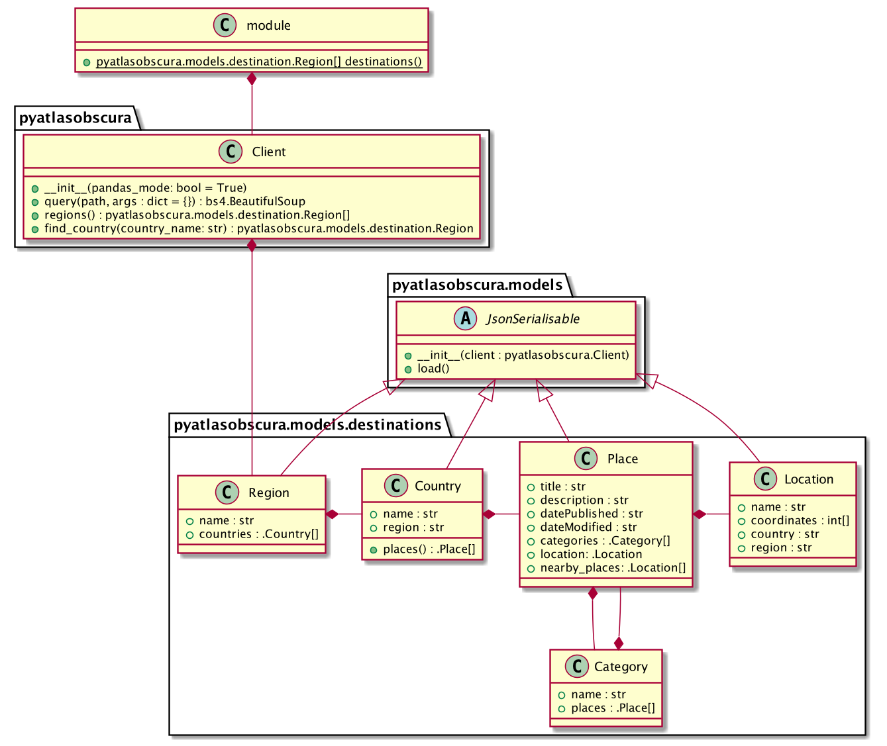

# pyatlasobscura

[](https://travis-ci.com/drewsonne/pyatlasobscura)

Library to interact with the Atlas Obscura website

## Quickstart

```bash
pip install pyatlasobscura
```

```python
import pyatlasobscura as ao
from pyatlasobscura import SearchType

for location in ao.search(SearchType.CATEGORY, 'books'):
    print(location.title)

destination = next(ao.destinations())

country = destination.countries[0]

place = next(country.places())
print(place)

print(place.categories)

place.load()

print(place)

```

See [examples](examples/basic.py) for more.

## Reference

Objects have the following structure


